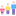
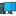

# Tworzenie dostępnych stron - WCAG w praktyce

<table>
 <tr>
     <td></td>
     <td style="text-align: justify;" >Dokument poświęcam zebraniu podstawowoych informacji na temat developmentu z świadomym implementowaniem standardu WCAG.</td>
 </tr>
</table>

## Na dobry początek...

### Co to jest dostępność?

Zapewnienie dostępu do informacji możliwie największej liczbie użytkowników niezależnie od:

<ul style="list-style-type: none;" >
    <li> wieku</li>
    <li> niepełnosprawności</li>
    <li> sprzętu</li>
    <li> oprogramowania</li>
</ul>

### Co to jest standard WCAG?

Standard WCAG to zbiór wytycznych odnoszących się do implementacji dostępnych stron WWW oraz dokumentów cyfrowych (np. PDF).

### Dla kogo standard WCAG został stworzony?

Dostępność cyfrowa została stworzona dla wszystkich użytkowników komputerów - nie tylko tych nie w pełni sprawnych.

### Przydatne narzędzia

 Podstawowowe:
- NVDA
- WAVE
- HeadingsMap
- Dev tools przeglądarki

 Dodatkowe:
- ARC Toolkit
- W3C Markup Validation Service
- Color Contrast Analyser

## Filary WCAG

- Postrzegalność
- Funkcjonalność
- Zrozumiałość
- Solidność

## WAI ARIA

### Co to jest ARIA?

Jest to zbiór atrybutów dodawanych do znaczników HTML.

<ul style="list-style-type: none;" >
    <li> Role(s) - mówi czytnikowi, że element jest czymś innym niż wskasuje na to znacznik.</li>
    <li> Prop(s) - określa dodatkowe atrybuty spoza standardu HTML.</li>
    <li> State(s) - określa aktualny stan elementu.</li>
</ul>

### Roles

- alert - ostrzeżenie
- status - komunikat
- button - przycisk
- checkbox
- dialog - okno dialogowe
- progressbar - pasek postępu
- slider - suwak

Uwaga! Rola nie zastępuje znaczenia semantycznego znacznika. \<button /> =/= \
 

### Props

- aria-atomic - który zmieniony tekst odczytać
- aria-controls - który element jest sterowany
- aria-describedby - opisany przez elment(y)
- aria-haspopup - czy jest rozwiajny
- aria-label - etykieta tekstowa
- aria-labelledby - etykieta z elementu
- aria-live - obszar aktywny
- aria-readonly - tylko do odczytu
- aria-required - czy wymagany
- aria-setsize - ilość elementów w zestawie
- aria-posinset - aktualna pozycja w zestawie

### States

Stany mamy dwa - true/false.

- aria-checked - czy zaznaczony
- aria-disabled - czy aktywny
- aria-expanded - czy rozwinięty
- aria-hidden - czy ukryty
- aria-invalid - czy prawidłowy
- aria-pressed - czy wciśnięty
- aria-selected - czy wybrany

Źródła
- https://www.w3.org/
- https://www.flaticon.com/
